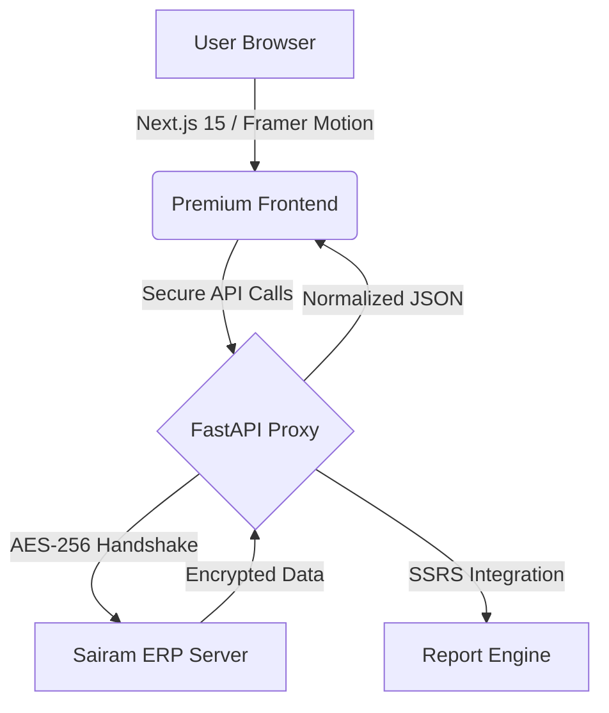

# 🎓 Edumate: Next-Gen Student Portal

[](https://opensource.org/licenses/MIT)
[](https://nextjs.org/)
[](https://fastapi.tiangolo.com/)
[](https://vercel.com/)

> **Experience the future of student management.** Edumate is a premium, high-performance dashboard that provides a sleek, glassmorphic interface on top of the Sairam Student Portal.

---

## 🎨 Premium UI/UX Experience

Edumate isn't just a portal; it's a productivity hub designed with a mobile-first, bento-grid philosophy.

- **💎 Glassmorphism 2.0**: A stunning, translucent interface with vibrant neon accents.
- **⚡ Performance First**: Staggered animations and non-blocking data fetching.
- **📅 Smart Attendance**: Interactive calendar view for tracking daily status and leave records.
- **📊 Academic Insights**: Visualized marks, GPA tracking, and automated report downloads.

---

## 🛠️ Technical Architecture

Edumate acts as a secure, high-speed proxy layer, augmenting the existing ERP with modern features and security.



### Core Tech Stack
| Layer | Technologies |
| :--- | :--- |
| **Frontend** | React 19, Next.js 15 (App Router), Tailwind CSS v4, Framer Motion |
| **Backend** | Python 3.12, FastAPI, HTTPX, PyCryptodome |
| **Security** | AES-256-ECB Encryption, SHA-256 Key Derivation, Secure Proxies |
| **Deployment** | Vercel Serverless (Python + Node.js Monorepo) |

---

## 🚀 Getting Started

### Prerequisites
- Node.js 18+
- Python 3.11+
- A valid Sairam Student Portal account

### 1. Clone & Setup
```bash
git clone https://github.com/aravi/edumate.git
cd edumate
```

### 2. Backend Initialization
```bash
cd backend
pip install -r requirements.txt
uvicorn main:app --reload
```

### 3. Frontend Initialization
```bash
cd ../frontend
npm install
npm run dev
```

The application will be available at `http://localhost:3000`.

---

## 📦 Deployment

Edumate is optimized for **Vercel** out of the box.

- The `vercel.json` file handles routing between the Next.js frontend and the FastAPI serverless functions in the `api/` directory.
- Simply link your GitHub repository to Vercel and it will auto-deploy the entire monorepo.

---

## 🤝 Contributing

Contributions are what make the open-source community such an amazing place to learn, inspire, and create. Any contributions you make are **greatly appreciated**.

1. Fork the Project
2. Create your Feature Branch (`git checkout -b feature/AmazingFeature`)
3. Commit your Changes (`git commit -m 'Add some AmazingFeature'`)
4. Push to the Branch (`git push origin feature/AmazingFeature`)
5. Open a Pull Request

---

## 📄 License

Distributed under the MIT License. See `LICENSE` for more information.

---

<p align="center">
  Built with ❤️ for the Sairam Community
</p>
