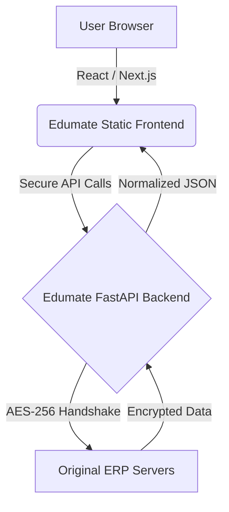

# 🎓 Edumate: Next-Gen Student Portal

[](https://opensource.org/licenses/MIT)
[](https://nextjs.org/)
[](https://fastapi.tiangolo.com/)

> **Experience the future of student management.** Edumate is a premium, high-performance dashboard that reconstructs the legacy Sairam Student Portal into a modern, lightning-fast, glassmorphic productivity hub.

---

## ✨ Features

Edumate acts as a secure proxy layer over the existing ERP, completely transforming the user experience:

- **💎 Premium UI/UX:** A stunning, translucent interface built with deep glassmorphism, Framer Motion animations, and Tailwind CSS v4.
- **📅 Smart Attendance & Timetable:** Real-time schedule tracking, daily attendance status, and interactive calendar views.
- **📊 Academic & Finance Hub:** Instantly check semester marks, track GPA, and view detailed fee breakdowns and receipts.
- **📥 Inbox & Mentoring:** A fully integrated 3-panel inbox system to read messages, download mentoring documents, and respond to faculty feedback.
- **📄 Document Upload:** Centralized hub for securely uploading and tracking student endorsements and professional certificates.
- **🎫 Hall Ticket Generation:** One-click PDF generation and download for current semester exam hall tickets.
- **⚡ Performance First:** Lightning-fast static frontend (exported) paired with a high-performance HTTPX connection-pooling backend.

---

## 🛠️ Technical Architecture


```mermaid
graph TD
    A[User Browser] -- React / Next.js --> B(Edumate Static Frontend)
    B -- Secure API Calls --> C{Edumate FastAPI Backend}
    C -- AES-256 Handshake --> D[Original ERP Servers]
    D -- Encrypted Data --> C
    C -- Normalized JSON --> B
```

### Core Tech Stack
| Layer | Technologies |
| :--- | :--- |
| **Frontend** | React 19, Next.js 16 (Turbopack, Static Export), Tailwind CSS v4, Framer Motion, Recharts, Lucide React |
| **Backend** | Python 3.12, FastAPI, Uvicorn, HTTPX (Async), PyCryptodome (AES-256-ECB) |
| **Deployment** | Vercel (Frontend Hosting) + Render (Backend Web Service) |

---

## 🚀 Getting Started Locally

### Prerequisites
- Node.js 18+
- Python 3.12+
- A valid Sairam Student Portal account

### 1. Clone & Setup
```bash
git clone https://github.com/YourUsername/edumate.git
cd edumate
```

### 2. Run the Backend
The backend handles the AES encryption handshake and proxies all requests to the legacy ERP.
```bash
cd backend
pip install -r requirements.txt
uvicorn main:app --reload
```
The backend will run on `http://localhost:8000`.

### 3. Run the Frontend
```bash
cd ../frontend
npm install
npm run dev
```
The application will be available at `http://localhost:3000`.

---

## 📦 Production Deployment

Edumate is optimized for a split-stack deployment to bypass serverless function limits and ensure zero-cost scaling.

### Frontend (Vercel)
1. In `frontend/next.config.ts`, ensure `output: 'export'` is set.
2. Link the repository to Vercel. Set the Root Directory to `frontend`.
3. Vercel will build and serve the app completely statically on their CDN.

### Backend (Render)
1. Create a new Web Service on Render linked to this repository.
2. Set the Root Directory to `backend`.
3. Build Command: `pip install -r requirements.txt`
4. Start Command: `uvicorn main:app --host 0.0.0.0 --port $PORT`
5. Add the Environment Variable: `FRONTEND_URL=https://your-vercel-domain.vercel.app`

---

## 🤝 Contributing

Contributions are what make the open-source community an amazing place to learn, inspire, and create. Any contributions you make are **greatly appreciated**.

1. Fork the Project
2. Create your Feature Branch (`git checkout -b feature/AmazingFeature`)
3. Commit your Changes (`git commit -m 'Add some AmazingFeature'`)
4. Push to the Branch (`git push origin feature/AmazingFeature`)
5. Open a Pull Request

---

## 📄 License

Distributed under the MIT License. See `LICENSE` for more information.

---

<p align="center">
  Built with ❤️ for a better student experience.
</p>
